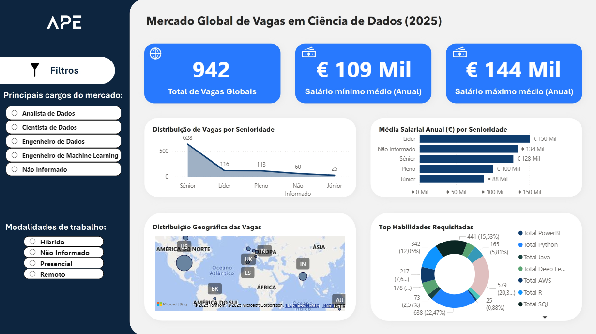

  

  
  
  

---

### 💡 Sobre Mim

📊 Profissional de Dados em formação com uma única missão: **transformar dados brutos em decisões de negócio claras e estratégicas**. Minha paixão é usar **Python, SQL e Machine Learning** para encontrar a história por trás dos números.

🚀 Demonstro minha capacidade em projetos que cobrem o ciclo de vida completo dos dados. Meu projeto principal, uma **análise de ponta a ponta de vagas em Data Science**, começou com **Engenharia de Dados em SQL**, evoluiu para a criação de um **modelo preditivo de salários em Python (Machine Learning)** e culminou em um **dashboard interativo no Power BI** para a apresentação dos resultados.

✨ **Meu grande diferencial?** Além da análise técnica, sou o fundador da **APE Technology**, onde meu trabalho é criar soluções para que profissionais consigam se destacar. Essa experiência me ensinou na prática a habilidade mais importante que o mercado busca: **saber comunicar valor**. Eu não apenas analiso os dados; eu entendo como apresentar a história por trás deles de forma impactante e convincente.

---

### 🛠️ Tecnologias e Ferramentas

  
  
  
  
  
  
  

---

## 🚀 Projeto em Destaque: Análise de Vagas de Dados (SQL → Python/ML → Power BI)

  

> * **O Desafio:** Analisar um dataset de vagas de Ciência de Dados para extrair insights sobre o mercado e construir um modelo de Machine Learning capaz de prever salários.
> * **A Solução:** Desenvolvi um pipeline completo em 3 etapas: **1. Engenharia de Dados (SQL)** para limpeza e criação de features avançadas; **2. Modelagem Preditiva (Python)** com `RandomForestRegressor` e `GridSearchCV`; **3. Business Intelligence (Power BI)** para criar um dashboard interativo.
> * **Resultado & Impacto:** O modelo alcançou um **R² de 62.37%**, e o projeto como um todo demonstra a capacidade de gerenciar o **ciclo de vida completo de um projeto de dados**, da preparação à comunicação de resultados.

  <a href="https://github.com/Guilh-Code/Analise-do-Mercado-de-Vagas-de-Ciencia-de-Dados-2025"><strong>Ver Código e Análise Completa &rarr;</strong></a>

---

## 📊 Outros Projetos Notáveis

<strong>Case 1: Engenharia de Features com SQL Avançado</strong>

 

> * **O Desafio:** Transformar dados transacionais brutos em uma **Feature Store** otimizada para ser consumida por modelos de Machine Learning.
> * **A Solução:** Desenvolvi um pipeline ETL **100% em SQL**, utilizando **CTEs** e **Funções de Janela** para criar mais de 10 features comportamentais.
> * **Resultado:** Uma tabela analítica de alta performance que **acelera o desenvolvimento de modelos preditivos**.
>
> 

>   <a href="https://github.com/Guilh-Code/Projeto-SQL-Preditivo-Engenharia-de-Features-para-Machine-Learning"><strong>Acessar Repositório &rarr;</strong></a> 
> 

<strong>Case 2: Previsão de Preços com Machine Learning</strong>

 

> * **O Desafio:** Desenvolver um modelo preditivo para estimar o preço de passagens aéreas e otimizar custos.
> * **A Solução:** Utilizei **Python** e **Scikit-learn** para treinar um modelo de Regressão Linear após uma Análise Exploratória de Dados (EDA) detalhada.
> * **Resultado:** O modelo alcançou uma **alta precisão (R² > 91%)**, provando ser uma ferramenta eficaz para decisões de compra estratégicas.
>  
> 

>   <a href="https://github.com/Guilh-Code/Previsao_do_preco_de_passagem_aerea"><strong>Acessar Repositório &rarr;</strong></a>
> 

<strong>Case 3: Análise de Churn com SQL e Python (End-to-End)</strong>

 
 
> * **O Desafio:** Investigar o aumento de cancelamentos (Churn) em uma plataforma de streaming.

> * **A Solução:** Realizei uma análise em duas etapas, com **SQL** para exploração profunda e **Python (Plotly)** para o storytelling visual dos insights.

> * **Resultado:** Identifiquei um padrão de comportamento inesperado ('Binge and Bolt') e entreguei hipóteses acionáveis para a equipe de negócio.
>
> 

>   <a href="https://github.com/Guilh-Code/Projeto-SQL-Python-Analise-de-Churn"><strong>Acessar Repositório &rarr;</strong></a> 
> 

<strong>Ver todos os projetos...</strong>

 

  <a href="https://github.com/Guilh-Code?tab=repositories"><strong>Acessar todos os repositórios &rarr;</strong></a> 

---

### 📚 Aprendizado Contínuo & Compartilhado

Acredito que o conhecimento só tem valor quando é compartilhado. Estes são meus guias de estudo públicos no Notion.

| Guia de Estudo | Descrição | Link |
| :--- | :--- | :--- |
| **🐍 Guia de Python para Data Science** | Anotações e códigos práticos do livro "Guia do Python para Data Science". |  |
| **🗄️ Guia de Estudos SQL** | Meu caderno de estudos público do curso de SQL, com resumos e checklists. |  |

---

### 🚀 Próximos Passos & Tecnologias em Foco

- **Power BI:** Aprimoramento em DAX e modelagem avançada.
- **Cloud (AWS/Azure):** Estudo de serviços de dados como S3, Glue e Redshift.
- **Pipelines de Dados:** Construção de pipelines mais robustos com ferramentas de orquestração.

---

  Sinta-se à vontade para explorar meus repositórios e entrar em contato!

  

