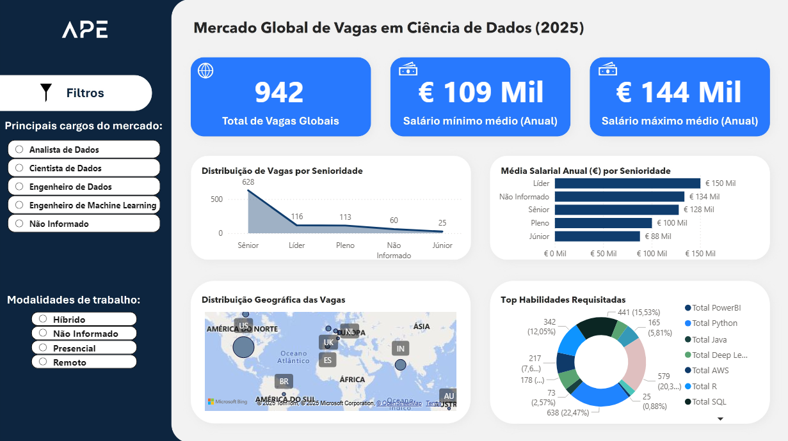
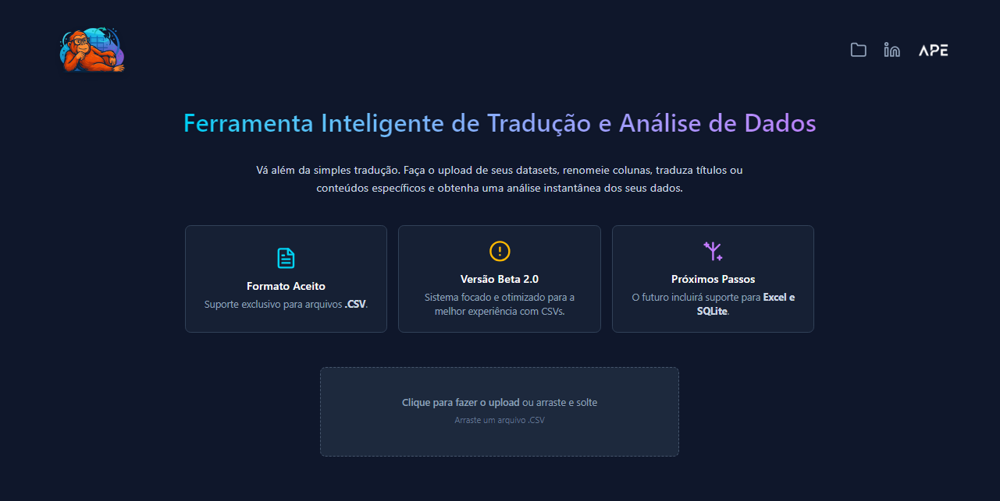

  

  
  
  

---

### 💡 Sobre Mim

🎓 Estudante de **Banco de Dados** com foco prático em **Ciência de Dados e Analytics**. Minha abordagem é ponta a ponta: atuo desde a engenharia e limpeza do dado bruto até a modelagem preditiva e visualização estratégica.

🛠️ Meus repositórios refletem desafios reais de mercado. Um destaque é meu projeto de **Análise de Vagas em Data Science**, onde apliquei **SQL Avançado** para engenharia de dados, treinei modelos de **Machine Learning em Python** para previsão de salários e construí um **Dashboard no Power BI** para tomada de decisão.

💼 **Diferencial de Negócio:** Além do código, possuo vivência prática no desenvolvimento de soluções digitais na **[APE Technology](https://apetechnology.com.br/)**. Essa experiência me ensinou a traduzir requisitos técnicos em valor para o cliente e a dominar a **comunicação de dados** (Data Storytelling).

---

### 🛠️ Tecnologias e Ferramentas

  
  
  
  
  
  
  
  

---

## 🚀 Projetos Principais

<table>
  <tr>
    <td width="50%" valign="top">
      <h3 align="center">Análise de Vagas de Dados (SQL → Python/ML → Power BI)</h3>
      

        
      

      

        <strong>O Desafio:</strong> Analisar um dataset de vagas para extrair insights e construir um modelo de ML para prever salários. 
        <strong>A Solução:</strong> Um pipeline em 3 etapas: Engenharia de Dados (SQL), Modelagem Preditiva (Python) e um dashboard de BI (Power BI). 
        <strong>Resultado:</strong> Prova de capacidade de gerenciar o ciclo completo de um projeto de dados, com um modelo de R² de 62%.
      

      

        <a href="https://github.com/Guilh-Code/Analise-do-Mercado-de-Vagas-de-Ciencia-de-Dados-2025"><strong>Ver Análise Completa &rarr;</strong></a>
      

    </td>
    <td width="50%" valign="top">
      <h3 align="center">Ferramenta de Preparação de Dados (Full-Stack)</h3>
      

        
      

      

        <strong>O Desafio:</strong> Eliminar o trabalho manual de traduzir datasets em inglês para análise. 
        <strong>A Solução:</strong> Uma aplicação web Full-Stack (SvelteKit + PHP) que permite upload de CSV, tradução e download em múltiplos formatos (JSON, XLSX, DB). 
        <strong>Resultado:</strong> Uma ferramenta prática que acelera o workflow de analistas de dados e demonstra competência Full-Stack.
      

      

        <a href="https://tradutor.apetechnology.com.br/"><strong>Acessar Ferramenta &rarr;</strong></a>
      

    </td>
  </tr>
</table>

---

## 📊 Outros Projetos Notáveis

<strong>Case 1: Engenharia de Features com SQL Avançado</strong>

 

> * **O Desafio:** Transformar dados brutos em uma **Feature Store** otimizada para ML.
> * **A Solução:** Um pipeline ETL **100% em SQL**, usando **CTEs** e **Funções de Janela**.
> * **Resultado:** Uma tabela analítica de alta performance que **acelera o desenvolvimento de modelos preditivos**.
>
> 

>   <a href="https://github.com/Guilh-Code/Projeto-SQL-Preditivo-Engenharia-de-Features-para-Machine-Learning"><strong>Acessar Repositório &rarr;</strong></a> 
> 

<strong>Case 2: Previsão de Preços com Machine Learning (R² > 91%)</strong>

 

> * **O Desafio:** Desenvolver um modelo preditivo para estimar o preço de passagens aéreas.
> * **A Solução:** Um modelo de Regressão Linear em **Python/Scikit-learn** após EDA detalhada.
> * **Resultado:** Alta precisão **(R² > 91%)**, provando ser uma ferramenta eficaz para decisões estratégicas.
>  
> 

>   <a href="https://github.com/Guilh-Code/Previsao_do_preco_de_passagem_aerea"><strong>Acessar Repositório &rarr;</strong></a>
> 

<strong>Case 3: Análise de Churn com SQL e Python</strong>

 
 

> * **O Desafio:** Investigar o aumento de Churn em uma plataforma de streaming.
> * **A Solução:** Análise em duas etapas com **SQL** para exploração e **Python (Plotly)** para o storytelling visual.
> * **Resultado:** Identificação de um padrão de comportamento inesperado ('Binge and Bolt') e hipóteses acionáveis.
>
> 

>   <a href="https://github.com/Guilh-Code/Projeto-SQL-Python-Analise-de-Churn"><strong>Acessar Repositório &rarr;</strong></a> 
> 

<strong>Ver todos os projetos...</strong>

 

  <a href="https://github.com/Guilh-Code?tab=repositories"><strong>Acessar todos os repositórios &rarr;</strong></a> 

---

### 📚 Aprendizado Contínuo & Compartilhado

Acredito que o conhecimento só tem valor quando é compartilhado. Estes são meus guias de estudo públicos no Notion.

| Guia de Estudo | Descrição | Link |
| :--- | :--- | :--- |
| **🐍 Guia de Python para Data Science** | Anotações e códigos práticos do livro "Guia do Python para Data Science". |  |
| **🗄️ Guia de Estudos SQL** | Meu caderno de estudos público do curso de SQL, com resumos e checklists. |  |

---

### 🚀 Próximos Passos & Tecnologias em Foco

- **Power BI:** Aprimoramento em DAX e modelagem avançada.
- **Cloud (AWS/Azure):** Estudo de serviços de dados como S3, Glue e Redshift.
- **Pipelines de Dados:** Construção de pipelines mais robustos com ferramentas de orquestração.

---

  Sinta-se à vontade para explorar meus repositórios e entrar em contato!

  

