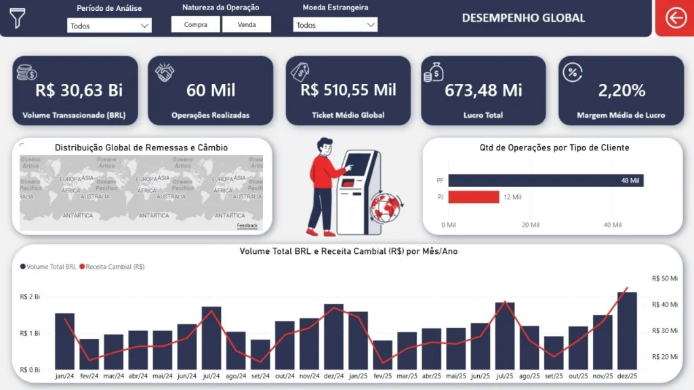
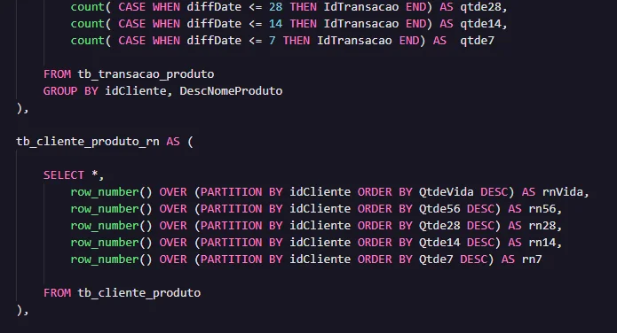

  

  
  
  

---

### 💡 Sobre Mim

🎓 Estudante de **Banco de Dados** (Faculdade Impacta) e atual **Estagiário de Governança e BI no Grupo Travelex Confidence**. Minha atuação é focada em transformar dados complexos em inteligência de negócios, unindo análise financeira, monitoramento de riscos e aplicação rigorosa de compliance.

🛠️ Meus repositórios refletem desafios avançados de mercado. Atuo com engenharia de dados (**SQL Avançado**), estruturação de painéis analíticos (**Power BI**) e desenvolvimento de bases preditivas (**Machine Learning / Python**), sempre garantindo a segurança e a governança do dado (como regras de LGPD e RLS).

💼 **Visão de Negócio:** Além do mundo corporativo financeiro, possuo vivência prática como fundador da **[APE Technology](https://apetechnology.com.br/)**, onde lidero o desenvolvimento de soluções digitais "End-to-End". Essa experiência me ensinou a ter "senso de dono", traduzindo requisitos técnicos em valor estratégico e dominando a comunicação de dados para executivos.

---

### 🛠️ Tecnologias e Ferramentas

  
  
  
  

---

## 🚀 Projetos Principais

<table>
  <tr>
    <td width="50%" valign="top">
      <h3 align="center">Inteligência Financeira e Compliance (Power BI & Governança)</h3>
      

        
      

      

        <strong>O Desafio:</strong> Combinar análise financeira de alto nível do mercado de câmbio com o monitoramento ativo de riscos. 
        <strong>A Solução:</strong> Desenvolvimento de um portal no Power BI atuando em duas frentes: Desempenho Global (volume financeiro PJ x demanda de tickets PF) e um painel investigativo de Compliance. 
        <strong>Resultado:</strong> Ferramenta robusta com detecção de anomalias (outliers) via matrizes de dispersão e aplicação rigorosa de Governança, incluindo anonimização de dados (LGPD) e Segurança em Nível de Linha (RLS).
      

      

        <a href="https://app.powerbi.com/view?r=eyJrIjoiNGI5Y2MzZWItZTg5NS00MzA5LThiOTUtYTYyOTMyNjlkOGRlIiwidCI6ImYzZDgzM2M2LWQ3ZGUtNDFjNC1hYTQ0LTMxZDc2YmYyNzA5YyJ9&pageName=a12a49b74f08f9b877c2"><strong>Ver Projeto Completo &rarr;</strong></a>
      

    </td>
    <td width="50%" valign="top">
      <h3 align="center">Engenharia de Features com SQL (Base Preditiva para ML)</h3>
      

        
      

      

        <strong>O Desafio:</strong> Transformar dados transacionais brutos em uma base analítica de alta performance (Feature Store) para alimentar modelos preditivos. 
        <strong>A Solução:</strong> Construção de um pipeline ETL completo utilizando exclusivamente SQL Avançado, com aplicação de CTEs e Funções de Janela (Window Functions) para criar métricas de comportamento. 
        <strong>Resultado:</strong> Uma tabela robusta que acelera o desenvolvimento de Machine Learning, garantindo dados otimizados para análises ágeis e precisas.
      

      

        <a href="https://github.com/Guilh-Code/Projeto-SQL-Preditivo-Engenharia-de-Features-para-Machine-Learning"><strong>Acessar Repositório &rarr;</strong></a>
      

    </td>
  </tr>
</table>

---

## 📊 Outros Projetos Notáveis

<strong>Case: Análise de Vagas de Dados (SQL → Python/ML → Power BI)</strong>

 

> * **O Desafio:** Analisar um dataset de vagas para extrair insights e construir um modelo de ML para prever salários.
> * **A Solução:** Um pipeline em 3 etapas: Engenharia de Dados (SQL), Modelagem Preditiva (Python) e um dashboard de BI (Power BI).
> * **Resultado:** Prova de capacidade de gerenciar o ciclo completo de um projeto de dados, com um modelo de R² de 62%.
>
> 

>   <a href="https://github.com/Guilh-Code/Analise-do-Mercado-de-Vagas-de-Ciencia-de-Dados-2025"><strong>Acessar Repositório &rarr;</strong></a> 
> 

<strong>Case: Ferramenta Full-Stack de Preparação de Dados</strong>

 

> * **O Desafio:** Eliminar o trabalho manual de traduzir datasets em inglês para análise.
> * **A Solução:** Aplicação web Full-Stack (SvelteKit + PHP) permitindo upload de CSV, tradução e download em múltiplos formatos (JSON, XLSX, DB).
> * **Resultado:** Uma ferramenta prática que acelera o workflow de analistas de dados.
>  
> 

>   <a href="https://tradutor.apetechnology.com.br/"><strong>Acessar Ferramenta &rarr;</strong></a>
> 

<strong>Case: Previsão de Preços com Machine Learning (R² > 91%)</strong>

 

> * **O Desafio:** Desenvolver um modelo preditivo para estimar o preço de passagens aéreas.
> * **A Solução:** Um modelo de Regressão Linear em **Python/Scikit-learn** após EDA detalhada.
> * **Resultado:** Alta precisão **(R² > 91%)**, provando ser uma ferramenta eficaz para decisões estratégicas.
>  
> 

>   <a href="https://github.com/Guilh-Code/Previsao_do_preco_de_passagem_aerea"><strong>Acessar Repositório &rarr;</strong></a>
> 

<strong>Case: Análise de Churn com SQL e Python</strong>

 
 
> * **O Desafio:** Investigar o aumento de Churn em uma plataforma de streaming.
> * **A Solução:** Análise exploratória com **SQL** e storytelling visual com **Python (Plotly)**.
> * **Resultado:** Identificação de padrões críticos e geração de hipóteses acionáveis.
>
> 

>   <a href="https://github.com/Guilh-Code/Projeto-SQL-Python-Analise-de-Churn"><strong>Acessar Repositório &rarr;</strong></a> 
> 

<strong>Ver todos os projetos...</strong>

 

  <a href="https://github.com/Guilh-Code?tab=repositories"><strong>Acessar todos os repositórios &rarr;</strong></a> 

---

### 📚 Aprendizado Contínuo & Compartilhado

Acredito que o conhecimento só tem valor quando é compartilhado. Estes são meus guias de estudo públicos no Notion.

| Guia de Estudo | Descrição | Link |
| :--- | :--- | :--- |
| **🐍 Guia de Python para Data Science** | Anotações e códigos práticos do livro "Guia do Python para Data Science". |  |
| **🗄️ Guia de Estudos SQL** | Meu caderno de estudos público do curso de SQL, com resumos e checklists. |  |

---

### 🚀 Próximos Passos & Foco Atual

- **Governança de Dados:** Aprofundamento em frameworks de compliance e segurança no ecossistema financeiro.
- **Power BI Avançado:** Domínio de DAX complexo e modelagem semântica voltada para grandes volumes de dados.
- **Cloud & Engenharia:** Exploração de soluções de nuvem para orquestração de pipelines.

---

  Sinta-se à vontade para explorar meus repositórios e entrar em contato!

  

